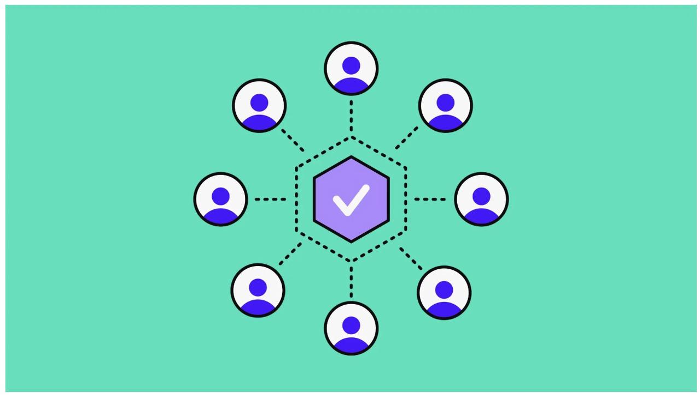

本文由 Cikey
翻译。原文是 [What Is a DAO? A Simplified Guide](https://www.webopedia.com/crypto/learn/dao-decentralized-autonomous-organization-explained/)
，作者是 Sal Miah。

**要点概述**

- DAO 是通过区块链技术运作的去中心化组织，利用智能合约来执行规则，并通过社区投票过程来做出决策。DAO 提供了透明性，并且不需要集中化的领导。
- DAO 的关键特征包括去中心化、自主性、透明性和社区驱动的治理。所有决策和交易都在区块链上公开记录。
- 与传统公司相比，DAO 在治理结构、透明度以及法律认可度上有明显不同。这既带来了低运营成本等优势，也面临法律不确定性和协调困难等挑战。
- DAO 被广泛应用于各个领域，例如 DeFi、社交和社区项目，以及NFT集体。截至 2024 年，Uniswap、Bittensor 和 Aave 等顶级 DAO
  在市值上处于领先地位。
- 去中心化金融和区块链技术的兴起催生了新的组织结构，去中心化自治组织（DAO）正在兴起，革新了社区治理和项目管理方式，并提供了一个去中心化的替代方案来取代传统企业结构。

在本文中，我们将探讨 DAO 的运作方式、其优势与局限性，以及它在加密领域中的日益增长的影响。

## DAO 是什么

去中心化自治组织（DAO）是一种基于预定规则自动运作的去中心化治理系统。它通过区块链技术和智能合约来实现这一点。DAO
并没有一个集中化的管理机构，而是通过区块链上的智能合约来执行其规则和决策。

在 DAO 中，所有决策都是通过投票过程由成员共同做出的，通常每一票的权重根据参与者持有的代币数量来决定。这种民主结构确保了社区自行管理组织，而不是由中央权力或少数高管控制。

DAO 的运作原则是透明和去中心化。DAO 内的每一笔交易和决策都会记录在区块链上，并向所有人开放。这种高度的透明性是 DAO
的一个关键吸引力，因为它消除了对中央权威的信任需求，并减少了腐败或管理不善的可能性。

## DAO 如何运作

DAO 通过智能合约、区块链技术和去中心化治理来运作。以下是其运作方式的概述：

## DAO 的功能是什么

DAO 在加密生态系统中承担了多种功能。它们可以管理去中心化金融（DeFi）协议，治理基于区块链的项目，甚至运营投资基金。

有些 DAO 专注于社会事业，而另一些可能致力于构建去中心化应用或管理数字资产。简而言之，DAO 可以执行任何传统组织可能承担的任务，但它是以去中心化的方式来实现的。

## DAO 的关键特征

- **去中心化**：与传统组织不同，DAO 没有集中化的领导。DAO 的成员集体做出决策，投票权通常根据代币持有量分配。
- **自主性**：智能合约治理 DAO，基于预定规则自动执行决策，减少了人工干预的需要。
- **透明性**：DAO 所采取的所有行动都会公开记录在区块链上，所有成员甚至外部人员都可以访问这些记录。
- **可访问性**：与传统组织不同，参与 DAO 不需要审批程序。唯一的要求是持有相应的代币。
- **社区驱动**：DAO 通常由其社区成员推动，这些成员对组织的决策和方向有直接发言权。

## DAO 如何治理

DAO 的治理由成员通过投票过程来执行。DAO 成员可以提交新的提案，其他成员可以对这些提案进行投票。DAO 智能合约中编码的规则决定了投票结果。

根据 DAO 的结构，提案可能需要简单多数票、超多数票或某种形式的共识才能通过。一旦提案获得批准，DAO 的智能合约会自动执行该决策，使治理过程既高效又透明。

## DAO 与公司——有什么不同？

虽然DAO和传统公司都是组织结构，但它们在治理、决策和透明度方面有着显著的不同。以下是关键区别：

- **中心化 vs 去中心化**：传统公司通常是等级制的，由董事会或高管做出决策。相比之下，DAO 是去中心化的，决策由社区集体做出。
- **透明度**：传统公司通常以一定程度的保密性运作，尤其是在内部决策和财务事项上。DAO 则完全透明，所有决策和交易都记录在区块链上。
- **治理**：在传统公司中，股东投票决定重大事项，但日常运营由管理层处理。而在 DAO中，社区投票决定每一项决策，无论大小。
- **法律结构**：传统公司是注册在特定司法管辖区内的法律实体，受当地法律法规的约束。而 DAO 往往处于法律的灰色地带，因为它们并不总是被视为法律实体。

## DAO 的优势

与传统组织结构相比，DAO 提供了一些显著的优势：

- **民主决策**：DAO 允许更民主的决策，所有成员都可以参与治理过程。
- **透明度**：由于所有行动都记录在公共区块链上，DAO 提供了无与伦比的透明度，减少了腐败或管理不善的可能性。
- **去中心化**：通过消除集中领导的需求，DAO 可以更高效地运作，并且不易受到个人偏见或错误的影响。
- **全球可访问性**：无论身处何地，个人都可以通过获取 DAO 代币自由加入 DAO。唯一的其他需求是网络连接。
- **较低的运营成本**：DAO 通过智能合约自动化流程，减少了对中间人的需求，并降低了运营成本。

## DAO 的局限性

尽管 DAO 有诸多优点，但它们也面临一些特定的挑战：

- **法律不确定性**：由于 DAO 并不总是被视为法律实体，它们可能面临法律问题，尤其是在责任和监管合规方面。
- **安全风险**：智能合约可能存在漏洞，如果被利用，可能导致重大财务损失。
- **决策速度**：虽然 DAO 是民主的，但决策过程可能较慢，因为需要大量成员的输入。
- **协调挑战**：没有中央领导的情况下，协调行动和对齐成员利益可能很困难。
- **对技术的依赖**：DAO 严重依赖区块链技术和智能合约，使其容易受到漏洞、黑客攻击、网络拥堵或其他技术问题的影响。

## DAO 如何盈利

DAO 根据其目的和结构，通过多种方式创造收入。以下是一些最常见的方式：

- **投资回报**：一些 DAO 作为去中心化投资基金运作，汇集成员的资源投资于加密资产或其他项目。利润随后分配给成员。
- **服务费用**：提供服务的 DAO，例如 DeFi 协议，可以对使用其平台收取费用。这些费用通常会分配给代币持有者或再投资于 DAO。
- **代币流通**：DAO 可以发行自己的代币并出售以筹集资金。这些代币可以授予投票权并分享 DAO 的利润。
- **资助和捐赠**：一些 DAO 从其他组织获得资助或捐赠，特别是如果它们专注于社会事业或开源开发。
- **收入分成**：DAO 可以与其他项目或公司达成收入分成协议，为 DAO 的资金库生成收入。

## DAO 的应用领域

DAO 在加密领域以多种方式进行创新。以下是一些示例：

- **DeFi**：在 DeFi 领域，DAO 管理去中心化协议，例如借贷平台或去中心化交易所。这些 DAO 负责协议的开发和运营，确保其安全性和功能性。
    - 如：MakerDAO 管理 DAI 稳定币，通过去中心化投票确保其稳定性和治理。

- **社交和社区项目**：DAO 管理社交和社区项目，成员共同决定项目的方向以及资源的分配。
    - 如：Friends with Benefits (FWB) 是一个社交 DAO，用户在其中合作开展创意和文化项目。

- **NFT 集体**：专注于 NFT 的 DAO 管理和策展非同质化代币（NFT）的收藏，成员可以投票决定收购和销售。
    - 如：FlamingoDAO 是一个专注于 NFT 的集体，策展并投资于数字艺术和收藏品。

## 市值前五的 DAO——截至2024年

根据 [CoinMarketCap](https://coinmarketcap.com/view/dao/) 的数据，截至 2024 年，以下 5 个 DAO 在市值上处于领先地位：

1. **Uniswap (UNI)**，市值 38.5 亿美元：作为 Uniswap DEX 的治理代币，UNI 持有者在加密领域最大的去中心化交易所之一中拥有发言权。
2. **Bittensor (TAO)**，市值 20.8 亿美元：TAO 是 Bittensor 的治理代币，这是一个连接机器学习模型的去中心化平台，旨在为机器学习领域创建去中心化市场。
3. **Aave (AAVE)**，市值 12.1 亿美元：AAVE 是 Aave 去中心化借贷平台的治理代币，允许用户参与平台的治理并获得奖励。
4. **Lido DAO (LDO)**，市值 9.76 亿美元：Lido DAO 治理着 Lido 协议，这是一个为多个区块链网络提供流动性质押服务的平台。
5. **Curve DAO (CRV)**，市值 5.92 亿美元：CRV 是 Curve 去中心化交易所的治理代币，该交易所专注于稳定币交易。

这些 DAO 不仅在市值上占据领先地位，还为其持有者提供了强大的治理和利益分享机制。

## 未来展望
随着去中心化金融和区块链技术的兴起，DAO 成为了组织治理的新范式。DAO 不仅重新定义了社区如何管理资源和做出决策，也为去中心化的全球协作和创新开辟了新的可能性。

然而，DAO 的发展仍处于早期阶段，面临许多技术和法律挑战。尽管如此，随着技术的不断进步和更多领域的采用，DAO
有望在未来几年内成为更具影响力的组织结构。

从智能合约到透明治理，DAO 为构建去中心化世界提供了强大的工具。它们不仅仅是技术创新，更是社区协作和创新的新模式。