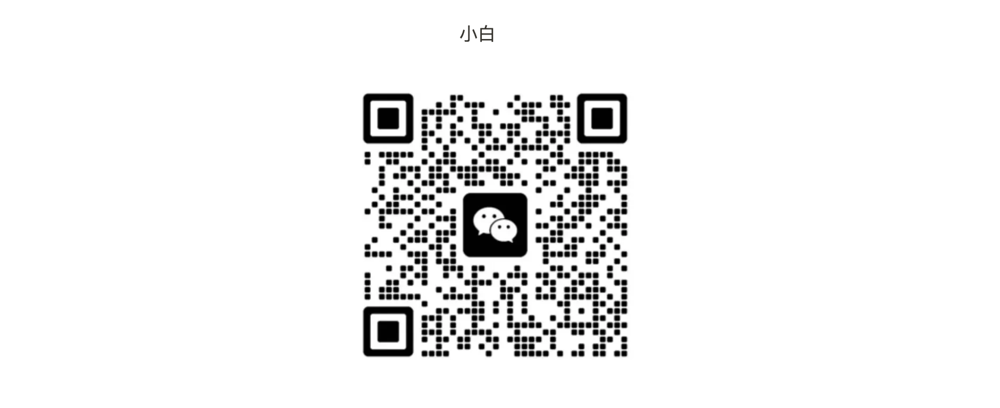

## 🎯 愿景

## 📖 引言

欢迎来到 KeyMapDAO 的 Web3 漫步指南！这里的内容简单易懂，专为所有人设计，让你轻松漫步到 Web3 世界。我们致力于用最直白的方式介绍复杂的概念，确保每个人都能轻松理解。
目前内容正在不断更新中......
然而，个人的力量是有限的，我们需要你们的帮助来丰富这个知识库。如果你有对你有帮助的新手文档或资源，请分享给我们。让我们一起共建这个平台，在分享中学习，同时也帮助更多人了解
Web3，推动整个生态的发展。
欢迎扫码加入Web3 新手村群，这里有一群同伴在等着你！

## 合作伙伴 - 南塘DAO
这是一个致力于乡村建设和Web3融合的DAO，于安徽省阜阳市颍州区南塘村建立了一个Web3青年的根据地，同时与在地乡村深度融合，发展出一个新的，具有活力的生态！南塘DAO目前已在当地建立了一个青年共居空间，进行了“乡建&Web3双边启蒙计划”、“PGS认证与Wen3结合项目”、“生态农业”等探索，也期望更多有理想的你们参与！

notion页面：[南塘DAO notion首页](https://www.notion.so/DAO-ba1ea7d047e3480bb89b210a5ea8d3d0)

南塘 DAO 邮箱：nantangdao2024@gmail.com

这里有一群同伴在等着你！
 

## 🌍 开始漫游

### 1. 漫步起点 - Web3 初识

#### （1）基础概念

- [0起步（必读）](https://tgn5x5g84p.feishu.cn/wiki/wikcn2cG75JUyWKs89bEsoNgvzb)
- [50 + 概念（简意版）](https://tgn5x5g84p.feishu.cn/wiki/Yhn5wGEXEiLkMrkc2d2caCJhnMJ)
- [政策趋势及法律法规](https://tgn5x5g84p.feishu.cn/wiki/wikcnf8sj25zAqyv99qFGIs2LAb)
- [资料查询](https://tgn5x5g84p.feishu.cn/wiki/wikcnXhP3JUzjXXfzKvfgkFvfad)
- [DAO 是什么？](https://tgn5x5g84p.feishu.cn/wiki/LlgZwAokViKPS9kpN75crcfJnuf)
- [浅谈DAO的投票设计](https://tgn5x5g84p.feishu.cn/wiki/SSavw6TdOihQYVk3BB2cAzOMnbc)

#### （2）其他内容

- [从披萨到全球颠覆：比特币与以太坊的从实验到主流之路](https://mp.weixin.qq.com/s/Ul5WgQDYivz2NLkCdZj2iw)
- [分析工具&信息来源](https://tgn5x5g84p.feishu.cn/wiki/wikcnefWg3MSuJ9dGpgyT57nhXd)

---

### 2. 经典之径 - Web3 必读

#### （1）白皮书+经典书籍

- [比特币白皮书](https://bitcoin.org/files/bitcoin-paper/bitcoin_zh_cn.pdf)
- [以太发白皮书](https://github.com/ethereum/wiki/wiki/%5B%E4%B8%AD%E6%96%87%5D-%E4%BB%A5%E5%A4%AA%E5%9D%8A%E7%99%BD%E7%9A%AE%E4%B9%A6)
- [从技术到应用：普通人的Web3学习手册](https://weread.qq.com/web/bookDetail/d9632ca0813ab86b4g012f1c)
- [货币未来.pdf](https://github.com/xboring/web3book/blob/main/pdf/%E8%B4%A7%E5%B8%81%E6%9C%AA%E6%9D%A5.pdf)
- [密码朋克.pdf](https://github.com/xboring/web3book/blob/main/pdf/%E5%AF%86%E7%A0%81%E6%9C%8B%E5%85%8B.pdf)
- [主权个人.pdf](https://github.com/xboring/web3book/blob/main/pdf/%E4%B8%BB%E6%9D%83%E4%B8%AA%E4%BA%BA.pdf)
- [greenpill中文版.pdf](https://github.com/xboring/web3book/blob/main/pdf/greenpill%E4%B8%AD%E6%96%87%E7%89%88.pdf)
- [ImpactDAOs中文版.pdf](https://github.com/xboring/web3book/blob/main/pdf/ImpactDAOs%E4%B8%AD%E6%96%87%E7%89%88.pdf)

#### （2）a16z

- [“你打算发币吗?” a16z CTO 带你深度解析代币种类及去中心化路径](https://mp.weixin.qq.com/s/yCKTTzIjYKVD66PvofwYvw)
- [从 0 到 1 的品牌革命：a16z 的品牌专家 Steven 教你如何在 Web3 中脱颖而出](https://mp.weixin.qq.com/s/jH3pUvV4QzklVSL54YdB4Q)

### 3. 护航之路 - Web3 安全指南

- [黑暗森林安全手册.pdf](https://github.com/xboring/web3book/blob/main/pdf/%E9%BB%91%E6%9A%97%E6%A3%AE%E6%9E%97%E5%AE%89%E5%85%A8%E6%89%8B%E5%86%8C.pdf)

### 4. 开发者漫步轨迹 - Web3 技术栈

#### （1）公链体系+钱包体系

- Golang
- Rust
- C++
- Haskell
- Java
- C#
- NodeJs
- Python
- Java

#### （2）去中心化应用方向

- Solidity
- NodeJs
- Rust
- Move
- sui
- Aptos

---

### 5. 火星漫游 - 加密交易与冒险

---

### 6. Just Have Fun

---

## 🤝 Web3 招聘（待开放）

## 👬 人才库（待整理）
