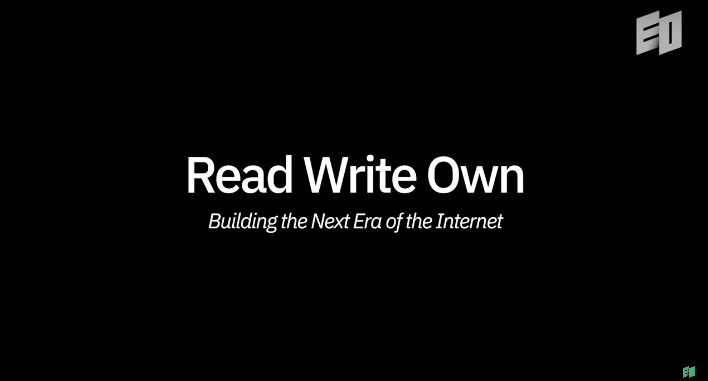
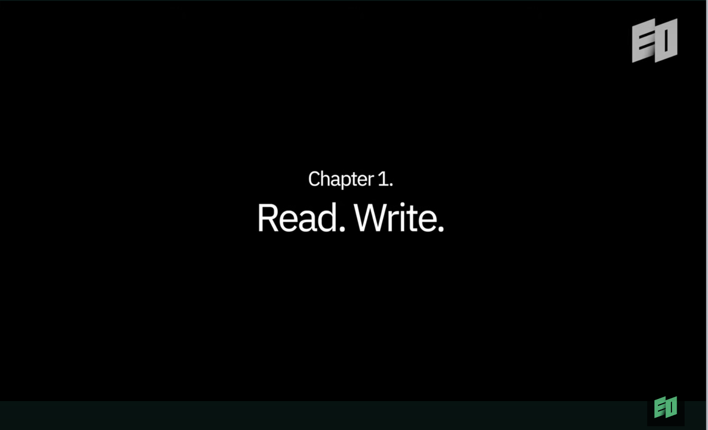
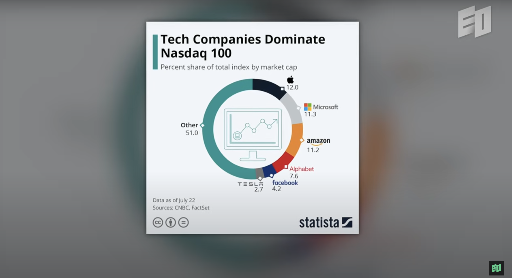
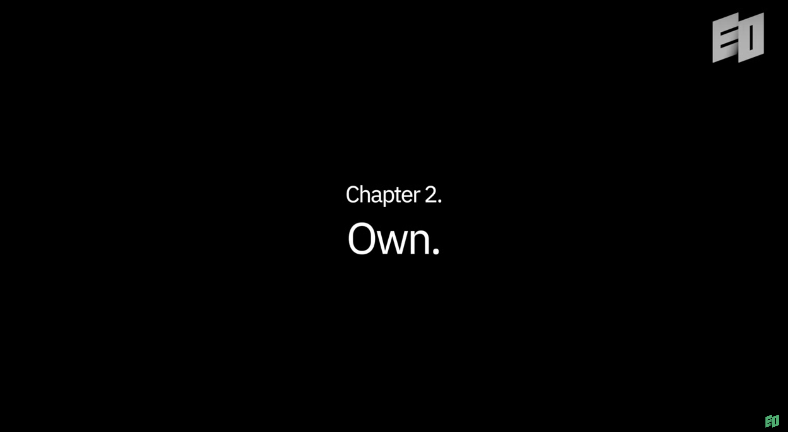
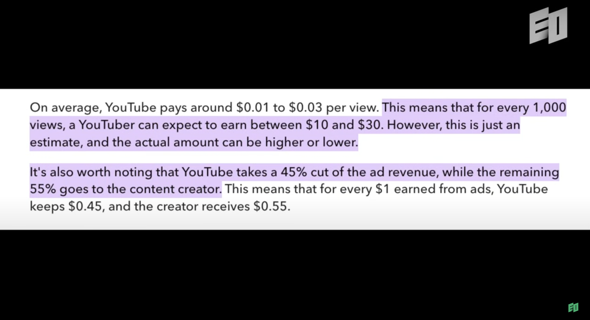
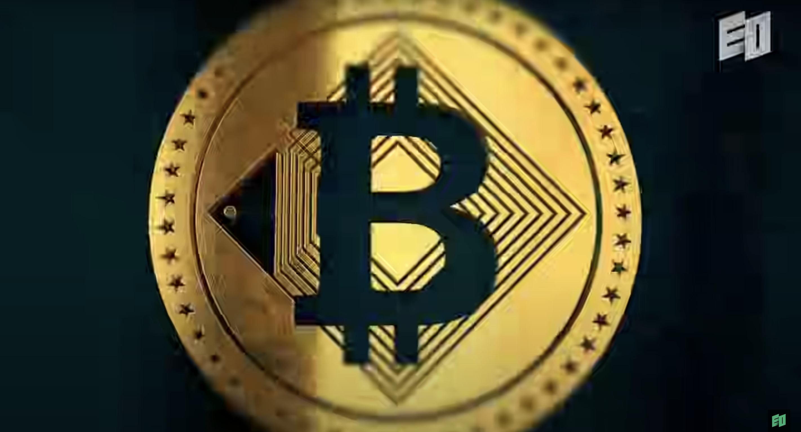
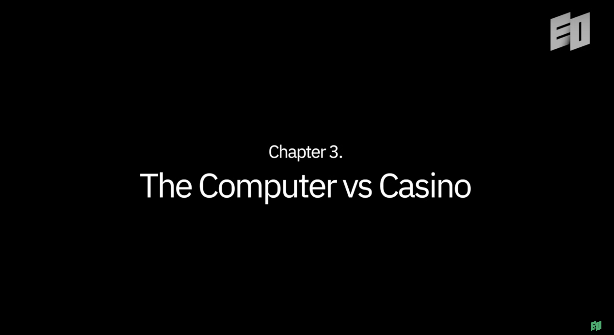
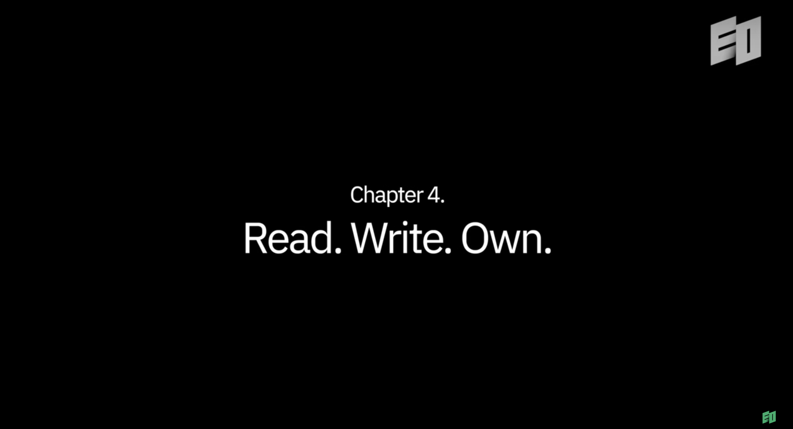

# a16z  | Web3.0 已死?

本篇文章由 Cikey 翻译、Sanzhi 校对，原视频 [「Is Web 3.0 Dead?」](https://www.youtube.com/watch?v=x6pJhK0LegI) 由 a16z 的合伙人、Crypto 的领军人物  Chris Dixon 主讲。

自 2013 年加入 a16z 以来，Dixon 不仅帮助塑造了公司的战略，还在 2018 年创立并领导了专注于 Web3 和区块链技术的 a16z crypto。如今，他管理着超 70 亿美元的投资基金，推动下一代互联网的快速发展。那他如何看待“ Is Web 3.0 Dead?”

⚠️ 更详细的信息，欢迎点击原文链接观看原视频。

---

目前 Crypto 确实面临了一些挑战，尤其是在美国的 FTX 事件和韩国的 Terra Luna 事件上。

虽然过去几年发生了不少不好的事情，但我并不认为 Crypto 已死。

实际上，每项创新技术都会经历波澜起伏。直接将“某些技术的用例不当”推断为“这项技术本身不好”是不对的，因为技术本身并没有好坏之分。

大家好，我是 Chris Dixon，a16z  的合伙人，同时也是 Crypto 基金会的创始人和负责人。

在过去的 25 年里，我一直与互联网行业紧密相连，起初我是一名软件工程师，后来转型成为一名创业者。我的第一家公司专注于网络安全，最终被 McAfee 收购；我的第二家公司则专注于 AI 领域，后来被 eBay 收购。"

自 2006 年以来，我还涉足了天使投资领域，投资了一些知名的互联网初创公司，其中包括 Pinterest、Stripe 和 Kickstarter 等。

2013 年，我加入了 Andreessen Horowitz，负责领导我们在 Coinbase 的投资。五年前，我们收购了 Oculus 的 VR 公司。从那时起，我便开始负责我们 Crypto 基金的业务发展和战略规划。

---

在 90 年代互联网的萌芽期，大多数在线服务都是单向的，我们称之为“只读型”。那时的网站更像是电子杂志或数字宣传册，用户主要是去获取信息，社交媒体的概念几乎不存在。

进入 2000 年，随着 Web 2.0 的兴起，我也投身其中。这场运动强调“读写”能力，催生了许多相关会议和博客。核心思想是互联网不应仅仅是被动接收信息的平台，而是一个互动的平台，用户不仅能消费内容，还能创造内容。Facebook、Twitter 等社交媒体平台的兴起，正是这一理念的体现，它们让互联网成为了一个真正的参与型媒介。

到了 2000 年代，网络型服务成为互联网的主导。Facebook、Uber、WhatsApp 等，都是连接人与人的平台，它们具有强大的“网络效应”——用户越多，服务的价值就越大。随着这些服务的扩张，它们的影响力也随之增强。

然而，我们正面临一个风险：互联网可能最终被少数几家大型科技公司如 Google、Amazon、Apple、Facebook 等所主导。我认为，这对新兴企业和整个社会的创新都不是好事。

---

互联网最开始是想建立一个去中心化的网络，将权力和财富归还给普通用户，而不是集中在少数大型公司手中。

在传统媒体行业，尤其是美国的电视和广播，资源和收入高度集中，由少数几个大频道控制。90 年代，当我和我的许多同行开始涉足互联网时，我们对互联网的潜力感到无比兴奋——它有望重新分配财富和权力，让它们回归到网络的边缘，也就是普通用户。

90 年代，互联网确实在某种程度上实现了这一点，但到了 2000 年代，这种去中心化趋势开始逐渐消失。

快进到今天，前五大科技公司占据了纳斯达克 100 指数市值的 50%，互联网上的流量和收入有 95% 以上集中在这几家公司手中，所有的趋势表明这种集中化还会继续加剧。

同时 AI 的发展令人瞩目，但如果不加以限制，它将进一步加速这种集中化。因为 AI 的技术需要掌握大量资金、数据和强大计算能力的企业，而这些正是大公司所拥有的。

在我的书中，我提出了一种解决方案：基于区块链的新一代互联网服务。

简单来说，简单来说，这类服务旨在消除中间环节，比如“看门人”和“收费站”。以 Facebook、Uber、Amazon、YouTube、Twitter 为例，这些平台都有资金流动，无论是广告费还是交易费，它们都收取一定比例的佣金，这在互联网行业被称为“抽成率”。

而互联网服务的“抽成率”非常高，通常在 50% 到 100% 之间，大部分流动的资金都进入了这些服务商的口袋。

此外，这些公司还掌控着整个网络，决定谁能访问网络，谁会被封号，决定算法如何运作。它们经常会改变规则，比如你贴的链接或内容类型可能会影响到是否被推荐或降权，这些算法是高度不透明的，完全由这些公司控制，而依赖这些网络的用户和内容创作者对此却毫无话语权。

这些中心化的服务商实际上掌握着用户的命运。这就是为什么我看重区块链技术的潜力，它能够为互联网带来一种新的属性——所有权。

区块链是一种革命性的发明，它能够实现许多功能，我将其视为一种新型的互联网计算机。它们基于云端，能够执行多种任务，但其中最关键的是能够赋予数字资产真正的所有权。

以比特币为例，最有趣的特性之一就是，私钥的拥有者就是比特币的真正所有者，这种所有权在 Twitter 或 Facebook 上是不存在的。

比如，我在 Twitter 上积累了多年的关注者，但如果 Twitter 的拥有者明天决定要关闭我的账户，明天我的账号就没了，从这个角度上来说，我并不是这个账号的真正拥有者。这种情况在互联网上已经发生过多次，无论是游戏中的虚拟物品、社交媒体上的内容，还是你在 PayPal 上的账户，在现有的互联网主流模式中，用户几乎没有真正的所有权。

而比特币引入了一个新的概念——用户可以拥有数字资产。自比特币诞生以来，技术人员已经将这种所有权概念扩展到了更广泛的领域，比如 NFT。

NFT 的核心理念是，你可以拥有一件艺术品、一个游戏道具，甚至一个代表社交媒体用户名的 NFT。在这种基于区块链的新模式中，用户可以真正拥有这些资产，而这些资产是不会轻易被剥夺的。

想象一下，如果我在社交媒体上拥有自己的用户名和关注者名单，并且对某个服务不满意，我可以带着我的用户名和关注者转到另一个平台。在这种区块链的全新模式下，我可以拥有我的用户名、关注者名单、数据，甚至可以拥有我为 AI 算法提供的一组数据。而在现有的互联网主流模式下，只有服务商或其背后的公司可以拥有这些数据和资源。

早期的互联网协议，如电子邮件，也具备类似的特性。例如，新闻通讯（newsletter）的复兴就是一个例证。许多记者选择离开传统媒体，通过 Substack 等平台开办自己的新闻通讯。这是因为当你有了自己的新闻通讯时，你就真正拥有了你的订阅者名单，你有他们的邮箱地址。Substack 等平台的抽成比例仅为 10% 左右，这样的低抽成也吸引了许多人使用它。

如果这些平台改变了规则，你完全可以选择离开，转向其他服务。基于区块链的服务也是基于同样的所有权概念。

现在，我们正处于一个关键时刻，Web 2.0 公司如 Facebook 拥有数十亿用户，而区块链服务的用户，若算上 Crypto 的人，也不过几亿。尽管使用新兴区块链游戏和社交媒体的用户数量大约有几千万，相对于整个互联网用户群体来说，仍然是一个较小的比例。因此，我们在这个发展阶段仍处于相对早期的阶段，我认为这与几个因素有关。

首先，是基础设施。比如，你现在玩一款基于区块链的游戏，其体验与非区块链游戏还是有所差别的。目前这些服务的底层基础设施仍在早期阶段，需要一定时间来降低成本，提高用户的体验。但我对未来几年可能出现的突破性进展充满期待。

另外，在我书中写到了区块链存在着两种文化：

一种是投机性质的“赌场文化”，另一种是更注重技术发展的“计算机文化”。赌场文化更关注于代币的短期买卖，而计算机文化则致力于构建新一代的互联网服务，这些服务将数字所有权交还给用户，降低中间费用，并由用户掌控，后者是我们更愿意推广和投资的，但遗憾的是，目前赌场文化似乎占据了主导地位，这不利于行业的健康发展。我期望能有明智的政策和监管措施来抑制投机行为，同时促进技术的积极发展。不幸的是，美国近年来的一些政策决策实际上助长了这种不良风气。

例如，上个月创建的 Meme 币数量超过了 50 万，创下了历史新高。与此同时，监管政策却对那些生产性的计算机文化行为施加了限制，这与我们希望看到的智能监管背道而驰。我期待这种情况能够改变，最近也出现了一些积极的迹象。

尽管 Crypto 领域遭遇了一些挑战，比如美国的 FTX 事件和韩国的 Terra Luna 事件，但这并不能说明整个领域失败。

历史告诉我们，每一项有趣的技术都会经历起伏，AI 和神经网络自 1943 年以来已经存在了近 80 年，AI 的概念也有很长的历史。艾伦·图灵在 1950 年发表了他的著名论文，描述了现在所称的图灵测试。尽管在 20 年前，像深蓝这样的国际象棋系统已经成为世界顶尖，但自然语言处理等其他应用的发展则相对缓慢。然而，在过去的十年中，机器学习算法在 ImageNet 竞赛中的表现逐渐接近并超越了人类水平，语言系统也在逐步改善。尽管发展过程缓慢，但确实在两年前取得了重大突破。如果你一直关注，可能会认为 AI 是个新兴领域，但它实际上是一个历史悠久的领域，经历了许多起伏。我认为许多技术都有这样的发展轨迹，包括区块链和 Crypto。

技术可以用于好的目的，也可以用于坏的目的。一把锤子可以用来建造房屋，也可以用来破坏房屋；肥料可以用来种植作物，也可以用来制造炸药。AI 可以用于欺诈和骗局，也可以用于提升人类的创造力。区块链同样可以被用于不正当的目的，但也能用于创造一波新的互联网服务，将资金和权力归还给互联网用户。
确保技术向善使用的方式就是为其设定规则。我认为，将特定技术的应用与技术本身混淆是个错误。在《Read Write Own》这本书中，我努力全面描述区块链的生产性用法。从“这项技术有坏用途”跳到“因此这项技术本身就是坏的”是个错误。技术本身是中立的，关键在于人和政府如何引导这项技术的潜力走向积极的方向。

我的书《Read Write Own》讲述了区块链和加密技术的潜力。多年来，我与许多人进行了关于区块链价值和前景的对话，而在这些对话中，我发现很难在单次会议中解释清楚，因为涉及到的知识背景往往是互联网企业家所共有的，但对更广泛的群体来说却不是普遍认知的。因此，我认为无论是写博客、文章还是书籍都有几个重要价值。

首先，我希望能够推动企业家，分享一些可能帮助他们的想法，促进他们的思考，希望能吸引更多人关注这项技术，让他们以正确的方式思考，从而创造出更多有趣的创业者来与我们交流。这样，我们的对话就会变得更加深入，因为他们已经阅读了很多内容，而我希望他们也能阅读我的作品，这样我们就能进入更高层次的对话。这在节省时间上非常有效。我们希望与最聪明的人合作，而这些人总是希望阅读有趣的内容。因此，这种方式有助于建立关系、分享知识，加速这个领域的发展。

区块链的关键特征是你可以构建新的互联网服务，而这些服务可以是我们今天在互联网上使用的任何东西，包括社交网络、游戏、市场和 AI 服务。这些服务的一个显著特点是，没有门槛和收费者，服务完全由用户掌控，资金也流向用户。

在我的书中，我探讨了这些概念，并将其应用于七个具体的领域，试图想象一旦企业家构建这些服务，未来会是怎样的景象。例如，谷歌搜索后，你需要点击进入依赖广告和付费墙盈利的网站。而在一个由 AI 驱动的世界里，你将不再需要这些中间步骤。我们正迅速进入一个新时代，在这个时代中，许多创作者的传统盈利模式可能会消失。如果可以直接通过 MidJourney 等 AI 服务生成插画，为何还要付费给插画师呢？这些 AI 服务从用户数据中学习，但并未为此支付费用，这是令人沮丧的结果。

我担心，互联网可能会被少数几个巨头所主导，这将排挤掉目前在互联网上赚钱的许多人。因此，我预测在未来 3 到 5 年内，我们将面临一场互联网危机，许多现有的商业模式将会消失。

因此，故事协议的概念带来了许多激动人心的可能性，它为数字创作领域带来了一种创新的商业模式。这个模式能将每个人的创造力汇聚在一起。比如，某人擅长编织故事情节，另一个人精于设计角色，再有人擅长将这些元素融合，甚至有人可能会分叉这些内容，创造出新的版本，类似于开源软件项目的方式。不论是手工绘制漫画还是利用 AI 技术生成，只要创作者设定了规则，这些创作方式都是可行的。

故事协议的精髓在于，它允许你定义创作内容和条款，并将它们记录在区块链上。区块链技术在确保记录不可篡改方面表现出色，每个记录都与法律协议挂钩，可以在有需要时通过法律途径执行。这种模式不仅依赖于对区块链的信任，也与现有的版权法体系相衔接。

AI 的参与也不会受到限制，你可以利用 AI 来创造或使用这些“乐高积木”，只要遵循区块链中设定的经济规则，你就可以以任何方式参与其中。这个系统为互联网规模的创意贡献和消费提供了可能，确保了创意工作者能够得到他们应得的回报。在 AI 系统可能颠覆或使许多现有商业模式过时的今天，这一点尤其重要。

所以，我希望这本书能成为非技术人员的易懂指南，用简单的直白语言解释互联网的运作方式、互联网的历史、区块链的潜力，以及我为何对这一切感到兴奋。

这本书也是为政策制定者准备的，因为我在职业生涯早期就发现，当人们认为某项技术已经走到尽头时，往往隐藏着最好的机会。

实际上，我的职业生涯开始时，人们就和我说互联网已经死了，在 2003 年和 2004 年成立了我的第一家公司，我发现我职业生涯中最好的机会是在人们说某件事已经死了的时候，我的经验是，AI 有它的起伏，互联网有它的起伏， 如果你想等到情况改善再行动，你将发现自己正与一大群人做相同的事情。

无论是 AI、互联网还是 Crypto，它们都会经历起伏，但成功的关键在于在这些波动中保持信念并敢于投资。
