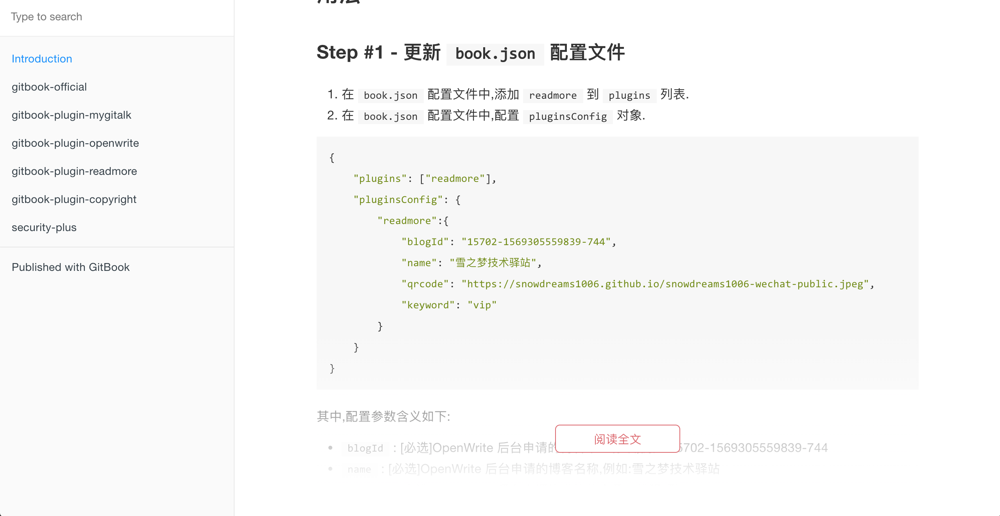

# 欢迎访问 [gitbook-plugin-last-update-time](https://snowdreams1006.github.io/gitbook-plugin-last-update-time/) 官网 👋

[](https://www.npmjs.com/package/gitbook-plugin-last-update-time)
[](https://www.npmjs.com/package/gitbook-plugin-last-update-time)
[](https://www.npmjs.com/package/gitbook-plugin-last-update-time)
[](https://github.com/snowdreams1006/gitbook-plugin-last-update-time/blob/master/LICENSE)
[](https://github.com/snowdreams1006)
[](https://snowdreams1006.github.io/snowdreams1006-wechat-public.jpeg)

> Gitbook 插件, 自动为标题栏添加当前时间以及在页脚位置添加最后更新时间

## 效果



## 用法

### Step #1 - 更新 `book.json` 配置文件

1. 在 `book.json` 配置文件中,添加 `last-update-time` 到 `plugins` 列表.
2. 在 `book.json` 配置文件中,配置 `pluginsConfig` 对象.

```json
{
    "plugins": ["last-update-time"],
    "pluginsConfig": {
        "last-update-time": {
            "label": "最后更新时间: ",
            "format": "YYYY-MM-DD HH:mm:ss"
        }
    }
}
```

其中,配置参数含义如下: 

- `label` : [可选] 页脚位置当前时间说明,默认`最后更新时间: `
- `format` : [可选] 页脚位置当前时间格式,默认`YYYY-MM-DD HH:mm:ss`,更多自定义格式请参考: [Moment.js](https://momentjs.com/)

### Step #2 - 运行 gitbook 相关命令

- 运行 `gitbook install` 命令安装到本地项目

```bash
# 方式一: gitbook安装插件
$ gitbook install

# 方式二: npm直接安装
$ npm i gitbook-plugin-last-update-time
```

- 运行 `gitbook build` 命令构建本地项目或者 `gitbook serve` 启动本地服务.

```bash
$ gitbook build
```

或者

```bash
$ gitbook serve
```

## 示例

不仅 [gitbook-plugin-last-update-time](https://github.com/snowdreams1006/gitbook-plugin-last-update-time) **官方文档**已整合 `last-update-time` 版权保护插件,此外还提供了示例项目,详情参考 `example` 目录.

- [官方文档](https://github.com/snowdreams1006/gitbook-plugin-last-update-time/tree/master/docs)
- [官方示例](https://github.com/snowdreams1006/gitbook-plugin-last-update-time/tree/master/example)

## 作者

👤 **snowdreams1006**

- Github: [@snowdreams1006](https://github.com/snowdreams1006)
- Email: [snowdreams1006@163.com](mailto:snowdreams1006@163.com)

## 🤝 贡献

如果你想贡献自己的一份力量,欢迎提交 [`Issues`](https://github.com/snowdreams1006/gitbook-plugin-last-update-time/issues) 或者 `Pull Request` 请求!

## 支持

如果本项目对你有所帮助,欢迎 ⭐️ [gitbook-plugin-last-update-time](https://github.com/snowdreams1006/gitbook-plugin-last-update-time) 项目,感谢你的支持与认可!

## 📝 版权

Copyright © 2019 [snowdreams1006](https://github.com/snowdreams1006).

This project is [MIT](https://github.com/snowdreams1006/gitbook-plugin-last-update-time/blob/master/LICENSE) licensed.